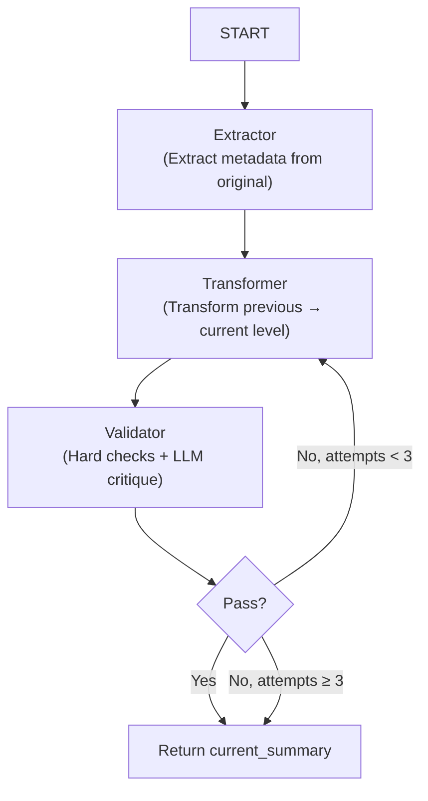

# Persona-Oriented Summary Shift Workflow (LangGraph Blueprint)

---

## 1 Overview

We build a three-node LangGraph pipeline—**Extractor → Transformer → Validator**—that can convert any Civil-Rights Clearinghouse summary into a family of clearly distinguishable variants along three orthogonal dimensions:

**Note**: The `Transformer` component in this codebase corresponds to the "rewriter" mentioned in the associated publication.

| Dim. ID | Dimension Name | Target Levels (0-4) |
|---------|---------------|---------------------|
| **Depth** | Depth ⇄ Conciseness | 0 (Original) … 4 (Headline Brief) |
| **Precision** | Technical Precision ⇄ Lay Accessibility | 0 (Law-school) … 4 (Grade 9, no cites) |
| **Procedural** | Procedural Detail ⇄ Narrative Clarity | 0 (Every motion and procedure) … 4 (Human-interest story) |

Each run specifies **{dimension, level}**. Levels are **monotonic**—you can recursively call the workflow (e.g., 0 → 1 → 2) to accumulate larger shifts. As a guardrail against hallucination and factual deviation from the source summary, `transformer` prompts take both the original summary and the N-1 level's summary as input.

### 1.1 Key Components

The dataset generator consists of several main components:

- **`dimension_shift_generator.py`**: Main generator class that orchestrates the transformation process
- **`dimension_shift_workflow.py`**: LangGraph-based workflow implementation with state management
- **`dimension_shift_agents.py`**: Individual agents (Extractor, Transformer, Validator) that perform specific tasks
- **`run_dimension_shift.py`**: Command-line interface for batch processing of case files

The system is designed to process legal case summaries one dimension at a time, creating progressive transformations from Level 0 (original) through Level 4 (maximum transformation) for each of the three dimensions. 

---

## 2 State Schema

```python
class ShiftState(TypedDict):
    original_summary: str      # immutable Level 0 text
    previous_summary: str      # N-1 level text to be refined  
    current_summary: str       # working draft of N level text
    dimension_config: DimensionConfig
    attempt: int
    original_metadata: Dict[str, Any]    # Metrics for original_summary (from Extractor)
    current_metadata: Dict[str, Any]     # Metrics for current_summary (from Validator)
    validation_result: Dict[str, Any]
```

---

## 3 Node Definitions

| Node | Purpose | Key Ops |
|------|---------|---------|
| **Extractor** | Extracts metadata from original summary: (1) Word count, (2) FKGL + New Dale-Chall readability scores, (3) Citation count via regex patterns, (4) Procedural keyword count using comprehensive lexicon | Pure Python functions with regex and textstat |
| **Transformer** | Uses persona-based, dimension-specific prompts to produce the **next-level** summary. Takes both previous summary and original summary as input for factual consistency. | LLM call with temperature=0.5 |
| **Validator** | Combines hard metric checks with LLM pairwise critique. Hard checks verify quantitative targets, LLM checks factual consistency and dimension-specific quality. Max 3 retry attempts. | Hard validation + LLM calls with temperature=0.0 |



The workflow implements a recursive refinement strategy where each level uses the previous level's output as input, with the original summary always available for factual grounding.

---

## 4 Configuration

- **Input Format**: JSON array of case objects with required fields (`id`, `summary`, etc.)
- **Output Format**: Structured JSON dataset with metadata and transformed summaries for all dimensions/levels
- **Default LLM**: gemini-2.5-flash (configurable via `llm_config`)
- **Validation**: Rule-based hard checks & LLM pairwise critique with chain-of-thought reasoning
- **Generator**: Follows established patterns from factual_omission_generator.py structure
- **Rate Limiting**: 10 RPM default with LangChain InMemoryRateLimiter for free-tier API compatibility
- **Resume Support**: Automatic tracking of processed cases for interrupted batch runs
- **Statistics**: Built-in computation of readability metrics (Flesch-Kincaid, Dale-Chall) and word count statistics

---

## 5 Validation Metrics

Here is a list of the validation metrics for each dimension that will be tracked and used to ensure the summaries meet the specified level of dimensionality shift. 

### 5.1 Depth ⇄ Conciseness
**Word count** is the primary metric for depth, with a target percentage of the original summary's word count. The fewer the words, the less information is included. 

We cannot guarantee a lower informational density due to the instability of LLMs in the dimensionality shift process. However, with the use of recursive limitation of word count, we can ensure that the information at higher levels will likely lose more information and shift from being a detailed summary to a concise and generalized one.

### 5.2 Precision ⇄ Lay Accessibility
We use the **Flesch-Kincaid Grade Level (FKGL)** and **New Dale-Chall readability (NCR) scores** to measure precision. The target is to lower the grade level while maintaining essential legal concepts.

**Citation regex count** is also used to ensure that the summary generalizes the legal citations to a more accessible format. The assumption here is that the fewer the citations, the more accessible the summary is to a layperson.

### 5.3 Procedural Detail ⇄ Narrative Clarity
The procedural detail is measured by the **procedure term frequency** present in the summary. The fewer the keywords, the more narrative clarity is achieved. The goal is to shift from a detailed procedural account to a more human-interest narrative.

**Procedural term frequency** is defined as `procedural_keyword_count / total_words`.

The procedural terms are measured using a **hardcoded lexicon of procedure terms**: This is a list of common legal terms that are used in the summaries. The number of these terms is counted and compared to the target level. We identify the stem of the word to ensure that we capture all variations of the term. For example, one could compile a list of words and phrases that typically signify procedural history or court actions, such as: "filed (a complaint/motion)", "submitted", "argued", "granted [motion/appeal]", "denied", "dismissed", "ruled", "held", "appealed", "affirmed", "reversed", "remanded", "court", "judge", "plaintiff", "defendant", etc.

---

## 6 Dimension Metrics (Hard Checks)

The metrics for each level should be computed before the transformer prompt and passed to the transformer node as part of the `dimension_config` in the state. Do not provide the computation or metrics of the original summary to the transformer agent. 

### Depth: Word Target Percentages
- Level 0: 100% of original
- Level 1: 85% of original  
- Level 2: 70% of original  
- Level 3: 50% of original   
- Level 4: 30% of original  

20% tolerance for the target word count.

### Precision: Readability and Citation Count Thresholds

| Level | FKGL Grade^ | NCR Score^ | Citation Count* |
|-------|------------|-----------|-----------------|
| 0     | Grade 13+  | 9.0+      | 100% of original citations |
| 1     | ≤ Level 0  | ≤ Level 0 | ≤ Level 0 citations  |
| 2     | ≤ Level 1  | ≤ Level 1 | ≤ Level 1 citations  |
| 3     | ≤ Level 2  | ≤ Level 2 | ≤ Level 2 citations  |
| 4     | ≤ Level 3  | ≤ Level 3 | ≤ Level 3 citations |

^Either FKGL or NCR score criteria must be met for the level to pass.
*Citation count must not exceed previous level.

### Procedural: Procedure Keyword Frequency Thresholds

| Level | Procedure Keyword Frequency^ | Procedure Term Count^ |
|-------|----------------------------| ----------------------|
| 0     | 100% of original frequency | 100% of original terms |
| 1     | ≤ Level 0 frequency        | ≤ Level 0 count        |
| 2     | ≤ Level 1 frequency        | ≤ Level 1 count        |
| 3     | ≤ Level 2 frequency        | ≤ Level 2 count        |
| 4     | ≤ Level 3 frequency        | ≤ Level 3 count        |

At each level, the frequency of procedural keywords OR procedural term count must not exceed the previous level, ensuring a progressive shift toward narrative clarity.
^Either frequency or count criteria must be met for the level to pass.

---

## 7 Usage

### 7.1 Environment Setup

First, ensure you have the required environment variables set:

```bash
# Set your Google API key for Gemini models
export GOOGLE_API_KEY="your_api_key_here"
# or alternatively
export GEMINI_API_KEY="your_api_key_here"
```

### 7.2 Basic Usage

The main entry point is `run_dimension_shift.py`, which processes legal case summaries from JSON files:

```bash
python run_dimension_shift.py --input input_cases.json --output shifted_summaries.json
```

**Command Line Arguments:**
- `--input`, `-i`: Input JSON file path (required)
- `--output`, `-o`: Output JSON file path (default: timestamped file in `../transformed_dataset/`)
- `--max-cases`, `-m`: Maximum number of cases to process
- `--processed-file`, `-p`: File to track processed case IDs for resume functionality (default: `processed_cases.txt`)

**Example:**
```bash
# Process up to 10 cases from input file
python run_dimension_shift.py -i cases.json -o results.json -m 10

# Resume processing from where you left off
python run_dimension_shift.py -i cases.json -o results.json
```

### 7.3 Input Format

Input JSON should contain an array of case objects with the following structure:

```json
[
  {
    "id": 11171,
    "name": "Grant v. Cuomo",
    "filing_date": "1985-10-28", 
    "state": "New York",
    "court": "New York state trial court",
    "summary": "On October 28, 1985, New York City families with children..."
  }
]
```

### 7.4 Output Format

The output JSON contains transformed summaries for each case across all dimensions and levels:

```json
{
  "metadata": {
    "generation_timestamp": "2025-01-15T10:30:00",
    "generator_version": "1.0.0",
    "model": "gemini-2.5-flash",
    "total_cases": 1,
    "dimensions": [...]
  },
  "cases": [
    {
      "case_id": 11171,
      "original_case_data": {...},
      "dimension_variations": {
        "Depth": {
          "dimension_name": "Depth ⇄ Conciseness",
          "levels": {
            "0": {"text": "original summary...", "success": true},
            "1": {"text": "85% condensed...", "success": true},
            "2": {"text": "70% condensed...", "success": true},
            "3": {"text": "50% condensed...", "success": true},
            "4": {"text": "30% condensed...", "success": true}
          }
        },
        "Precision": {...},
        "Procedural": {...}
      }
    }
  ]
}
```

### 7.5 Resume Functionality

The script automatically tracks processed cases in a text file (default: `processed_cases.txt`). If processing is interrupted, simply run the same command again to resume from where you left off.

### 7.6 Rate Limiting

The system includes built-in rate limiting for free-tier API compatibility:
- Default: 10 requests per minute for Gemini API
- Configurable via `llm_config` in the code
- Uses LangChain's `InMemoryRateLimiter` for automatic throttling

### 7.7 Programmatic Usage

You can also use the generator programmatically:

```python
from dimension_shift_generator import DimensionShiftGenerator

# Initialize with custom configuration
llm_config = {
    "model": "gemini-2.5-flash",
    "temperature": 0.25,
    "rate_limit_rpm": 10
}

generator = DimensionShiftGenerator(llm_config=llm_config)

# Process a single case
case_data = {...}  # Case dictionary
result = generator.create_dimension_dataset(case_data)

# Process multiple cases
results = generator.process_multiple_cases(cases_list, max_cases=5)

# Save results
generator.save_dataset(results, "output.json")
```

---

## 8 Implementation Notes 

- **Abstract Workflow**: Can handle any dimension agents, not hardcoded to 3 dimensions
- **Minimal Code**: Bare minimum LangGraph with modular design
- **No Over-engineering**: Removed fault tolerance, soft validation, and complex error handling
- **Recursive Dimension Shift**: Each level uses previous level's output as input
- **Pairwise Critique**: LLM validation checks for factual consistency and dimension-specific criteria
- **Accommodate Free-tier API rate limits**: The workflow is designed to handle the free-tier API limit on requests per minutes with delay mechanism.

### 8.1 Transformer Agent Implementation

The `TransformerAgent` implements a **persona-based transformation strategy** with dimension-specific prompts and strong negative constraints to prevent cross-dimensional contamination.

#### 8.1.1 Recursive Refinement Strategy
The transformer takes both the **current summary** (Level N-1) and the **original summary** (Level 0) as input to prevent factual drift:

```python
def transform_summary(self, current_summary: str, original_summary: str, 
                     dimension_config: DimensionConfig, original_metadata: Dict[str, Any], 
                     failure_reason: Optional[str] = None) -> str:
```

The system prompt enforces factual consistency:
```
You are an expert legal editor. Your task is to rewrite the <SOURCE_SUMMARY> to meet specific 
transformation goals, while ensuring all key facts (like parties, core legal claims, and ultimate 
outcomes) remain factually consistent with the <ORIGINAL_SUMMARY>. You may draw core facts from 
the <ORIGINAL_SUMMARY> as needed, but you CANNOT add depth, technical or procedural details to 
the transformed summary.
```

#### 8.1.2 Persona-Based Prompting
Each dimension and level has a specific **persona** and **transformation rule**:

**Depth Dimension Examples:**
- Level 1: "Senior Associate Attorney" → "Condense without losing substance"
- Level 2: "Managing Editor of a Legal Journal" → "Summarize procedural clusters"  
- Level 3: "In-House Counsel briefing an executive" → "Reformat for scannability"
- Level 4: "News Headline Writer" → "Distill to the absolute essence"

**Precision Dimension Examples:**
- Level 1: "Senior Lawyer editing a junior's draft" → Grade 12 vocabulary
- Level 2: "Journalist for the Associated Press" → Grade 10 vocabulary
- Level 3: "High School Civics Teacher" → Grade 9 vocabulary
- Level 4: "Writer for a 'News for Kids' website" → Grade 8 vocabulary

**Procedural Dimension Examples:**
- Level 1: "Legal Historian" → "Explain the 'why' behind the 'what'"
- Level 2: "Law Student writing a case brief" → "Center the legal question and the court's answer"
- Level 3: "Policy Analyst for an advocacy group" → "Focus on the outcome and its real-world impact"
- Level 4: "Feature Writer for a magazine" → "Tell the story of the people"

#### 8.1.3 Negative Constraints
Each dimension includes explicit constraints to prevent unintended changes:
- **Depth**: "Preserve the original level of technical vocabulary and procedural focus"
- **Precision**: "Preserve the original length and level of procedural detail"  
- **Procedural**: "Do not significantly change the word count or vocabulary complexity"

#### 8.1.4 Retry Mechanism  
When validation fails, the transformer receives specific feedback:
```python
retry_note = f"<RETRY_CONTEXT>Previous validation failed due to: {failure_reason}. 
Pay close attention to this feedback and address the issue in your new response.</RETRY_CONTEXT>"
```

---

### 8.2 Validator Agent Implementation

The `ValidatorAgent` combines **hard metric checks** with **LLM pairwise critique** using chain-of-thought reasoning and relative thresholds for progressive validation.

#### 8.2.1 Hard Checks with Relative Thresholds
The validator uses **relative thresholds** that compare each level against the previous level, ensuring monotonic progression:

```python
def _hard_checks(self, new_metadata: Dict[str, Any], original_metadata: Dict[str, Any], 
                config: DimensionConfig) -> Dict[str, Any]:
```

**Depth Validation:**
- **Absolute Threshold**: Word count must be within ±20% of target percentage of original
- Level 1: 85% ± 20% tolerance of original word count
- Level 4: 30% ± 20% tolerance of original word count

**Precision Validation:**
- **Relative Threshold**: FKGL score OR NCR score must be lower than previous level
- **Absolute Threshold**: Citation count must not exceed previous level
- Either readability improvement OR citation reduction satisfies the check

**Procedural Validation:**
- **Relative Threshold**: Procedural keyword frequency OR term count must be lower than previous level
- Either frequency reduction OR absolute count reduction satisfies the check

#### 8.2.2 LLM Pairwise Critique with Chain-of-Thought
The LLM validation follows a structured reasoning process:

```python
def _llm_pairwise_critique(self, transformed_text: str, previous_text: str, 
                          original_text: str, config: DimensionConfig) -> Dict[str, Any]:
```

**Chain-of-Thought Prompt Structure:**
1. **Factual Consistency Check**: "First, identify the core facts present in the <ORIGINAL_SUMMARY> (parties, core dispute, outcome). Second, check if these core facts are all present in the <NEW_SUMMARY>."

2. **Dimension-Specific Check**: 
   - **Depth**: "Does <NEW_SUMMARY> omit low-importance details while retaining the core factual basis and outcome?"
   - **Precision**: "Does <NEW_SUMMARY> use more accessible & simplified language without being misleading?"
   - **Procedural**: "Does the <NEW_SUMMARY> focus more on the parties involved, the real-world context, and outcome's impact, rather than court actions?"

**Response Format:**
```
Factual Consistency: YES/NO - [brief explanation if No]
Dimension Check: YES/NO - [brief explanation if No]
```

#### 8.2.3 Validation Result Integration
The validator returns comprehensive results with unified failure messaging:

```python
return {
    "passed": hard_check_result["passed"] and llm_critique_result["passed"],
    "new_metadata": new_metadata,
    "hard_checks": hard_check_result,
    "llm_critique": llm_critique_result,
    "failure_reason": failure_reason_str  # Unified string for transformer feedback
}
```

#### 8.2.4 Retry Logic with Feedback Loop
- **Max 3 attempts** per level transformation
- **Failure reasons** are passed back to the transformer for retry attempts
- **Combined feedback** from both hard checks and LLM critique guides retry strategy
- After 3 failures, workflow returns **FAILED** status but continues to next level

#### 8.2.5 Temperature Configuration
- **Transformer LLM**: Temperature 0.5 for creative adaptation
- **Validator LLM**: Temperature 0.0 for consistent evaluation

---

### 8.3 ExtractorAgent Implementation

The `ExtractorAgent` performs **pure Python analysis** without LLM calls, extracting quantitative metrics for validation:

#### 8.3.1 Comprehensive Procedural Keyword Lexicon
The extractor uses a comprehensive lexicon of 70+ procedural terms covering:
- **Core procedural verbs**: file, submit, argue, grant, deny, dismiss, rule, hold, appeal, etc.
- **Legal entities**: court, plaintiff, defendant, attorney, magistrate, etc. 
- **Procedural concepts**: motion, hearing, judgment, trial, discovery, testimony, etc.

#### 8.3.2 Citation Detection with Regex
Advanced regex pattern matching for Bluebook citation formats:
- **Federal reporters**: U.S., S. Ct., F.2d, F.3d, F.Supp.2d, etc.
- **Regional reporters**: A.2d, N.E.2d, P.2d, etc.
- **State-specific reporters**: Cal. Rptr., N.Y.S.2d, etc.
- **Complete citation structure**: Volume + Reporter + Page + Optional pinpoint and parenthetical

#### 8.3.3 Readability Metrics
- **FKGL Score**: Flesch-Kincaid Grade Level using textstat library
- **NCR Score**: New Dale-Chall Readability Score using textstat library
- **Word Count**: Simple split-based counting for consistency

---

## 9 LangGraph Workflow Implementation

The workflow is implemented using **LangGraph** with a simple three-node state machine:

### 9.1 Workflow Structure
```python
class DimensionShiftWorkflow:
    def _build_graph(self) -> StateGraph:
        workflow = StateGraph(ShiftState)
        
        workflow.add_node("extractor", self._extractor_node)
        workflow.add_node("transformer", self._transformer_node)
        workflow.add_node("validator", self._validator_node)
        
        workflow.add_edge(START, "extractor")
        workflow.add_edge("extractor", "transformer")
        workflow.add_edge("transformer", "validator")
        workflow.add_conditional_edges("validator", self._route, {"retry": "transformer", "end": END})
```

### 9.2 State Management
The workflow uses a `ShiftState` TypedDict that tracks:
- **original_summary**: Immutable Level 0 reference
- **previous_summary**: Level N-1 input to transformer
- **current_summary**: Working Level N output
- **attempt**: Retry counter (max 3)
- **validation_result**: Pass/fail status with failure reasons

### 9.3 Multi-Level Processing
The `multi_level_shift` method processes levels sequentially:
1. **Level 0**: Extract original metadata
2. **Level 1**: Transform from Level 0 → Level 1  
3. **Level 2**: Transform from Level 1 → Level 2
4. **Continue** until target level or failure

Each level builds on the previous successful transformation, ensuring progressive refinement.
