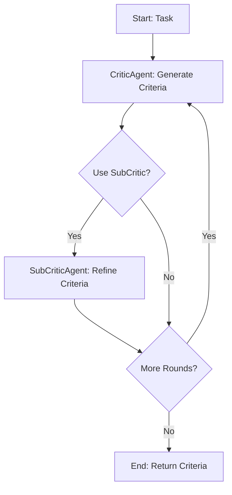
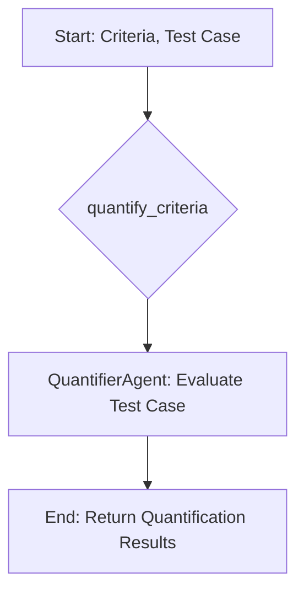
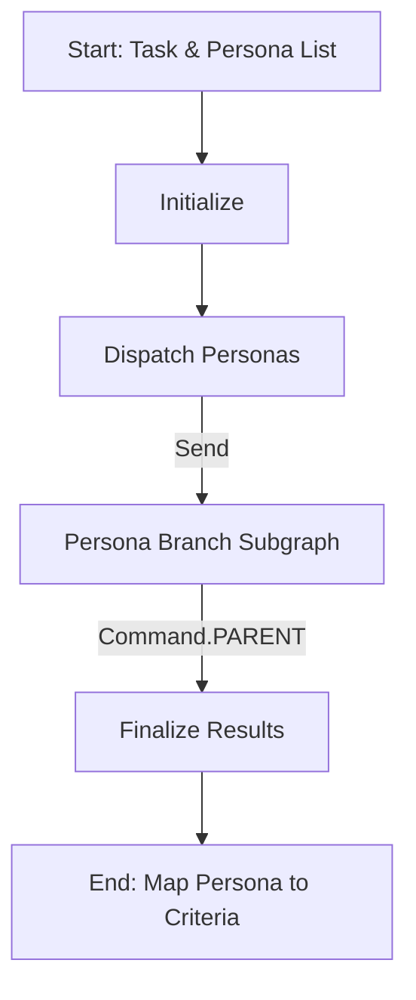
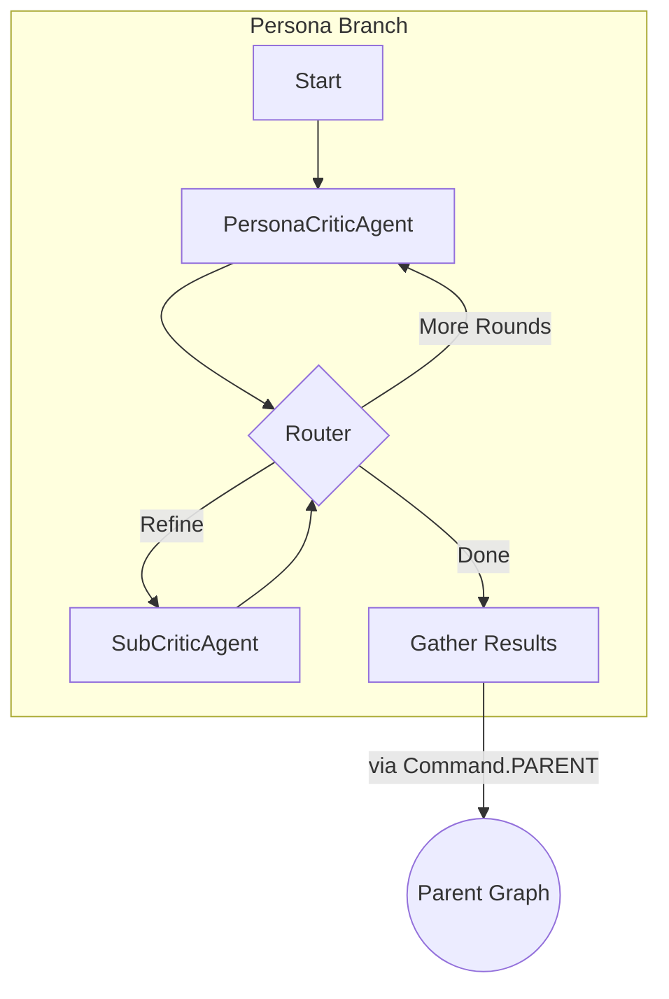

# PersonaEval & AgentEval Design Document

## 1. Introduction

AgentEval is a framework designed to assess the utility and effectiveness of LLM-powered applications. It provides a structured, automated, and scalable way to evaluate applications by leveraging a multi-agent system. This approach offers a cost-effective alternative to traditional human evaluations, enabling developers to get detailed, multi-dimensional feedback on their application's performance.

The core idea is to first define what "good" performance means for a specific task by generating a set of evaluation criteria, and then to quantify the application's output against these criteria. The entire process is orchestrated using LangGraph, which allows for flexible and stateful agent workflows.

This implementation is inspired by Microsoft's AgentEval framework and is built using a similar set of agents and concepts.

PersonsEval, on the other hand, is a derivative framework extended from AgentEval by contextualizing the critiera generation with the lens of defined "Persona". Persona is defined as different types of consumsers/users that will utilize the applications. The core principle of characterizing persona are defining a mutually exclusive collective exhdaustive set of users -- each of them with different priority and informational needs and they combined cover all the target users for the applications. 

We hypothesize that PersonaEval is able to accurately evaluate the utiilty of the application with better alignment with human judgments, compared to other LLM automatic evaluation framework in the market. 

With PersonaEval, we could have a more true-to-tone and scalable evaluation of the LLM applications that enables human user to quickly estimate the utility of the LLM applications.

## 1.1. AgentEval's Implementation Differences from AutoGen Article
- Replaced AutoGen workflows with LangGraph-based state machines (`create_criteria_generation_workflow`, `create_quantification_workflow`).
- Agents extend a custom `BaseAgent` using LangChain (`ChatOpenAI`, `ChatGoogleGenerativeAI`, `ChatAnthropic`), not AutoGen agent abstractions.
- No `VerifierAgent` implemented yet; verification step is planned for future work.
- `QantifierAgent` is prompted to return a "numerical score" for downstream analysis, on top of the original assessed performance based on the accepted values. 
  
## 2. Core Components (Agents)

The framework is composed of several specialized agents, each with a distinct role in the evaluation process.

### 2.1. `BaseAgent`
This is the foundational class for all other agents. It handles the low-level interaction with the Language Models (LLMs).
- **Responsibilities**:
    - Manages LLM configuration (e.g., model name, API keys, temperature).
    - Supports multiple LLM providers (Google Gemini, Anthropic Claude, OpenAI).
    - Provides synchronous (`invoke`) and asynchronous (`ainvoke`) methods for sending prompts to the LLM.
- **File**: `src/agents/base_agent.py`

### 2.2. `CriticAgent`
The `CriticAgent` is the starting point of the evaluation process. It is responsible for defining *how* to measure the performance of a task.
- **Responsibilities**:
    - Analyzes a task description to generate a list of relevant evaluation criteria.
    - For each criterion, it provides a name, a detailed description, and a list of acceptable values (e.g., "Correct", "Minor errors", "Incorrect").
    - Outputs a structured list of `EvaluationCriterion` objects.
- **File**: `src/agents/critic_agent.py`

### 2.3. `SubCriticAgent`
The `SubCriticAgent` acts as a refiner for the criteria generated by the `CriticAgent`. It enhances the evaluation by adding more granularity.
- **Responsibilities**:
    - Takes the initial criteria and breaks them down into more detailed sub-criteria where appropriate.
    - When a criterion is broken down, the original `accepted_values` are replaced by a dictionary of sub-criteria, each with its own description and accepted values.
    - This allows for a more nuanced and hierarchical evaluation.
- **File**: `src/agents/subcritic_agent.py`

### 2.4. `QuantifierAgent`
The `QuantifierAgent` performs the actual evaluation. It takes the generated criteria and a specific test case (an output from the application being evaluated) and scores it.
- **Responsibilities**:
    - Evaluates a given test case against each criterion (and sub-criterion).
    - For each criterion, it provides an assessed performance value and a numerical score (0-10).
    - It can handle both flat criteria and nested criteria with sub-criteria.
    - Outputs a structured `QuantificationResult` object.
- **File**: `src/agents/quantifier_agent.py`

### 2.5 `PersonaCriticAgent`
The `PersonaCriticAgent` is a subclass of `CriticAgent` with modified prompt that requires contextualizing the criteria generation based on the perspective of a given persona. 
- **Responsibilities**:
    - Analyzes a task description *and persona profiles* to generate a list of relevant evaluation criteria that prioritize the persona's informational needs. 
    - For each persona, outputs a structured list of `EvaluationCriterion` objects independently.
- **File**: `src/agents/persona_critic_agent.py.py`

## 3. Architecture and Workflow

The evaluation process is divided into two main workflows, orchestrated by LangGraph state machines.

### 3.1 AgentEval
#### 3.1.1 Data Models
The workflows rely on a set of well-defined data models to manage state.
- **`Task`**: Defines the application or task to be evaluated, including its name, description, and examples of successful/failed outputs.
- **`Criterion`**: Represents a single evaluation metric. It can be nested to support sub-criteria, forming a tree-like structure.
- **`EvaluationState`**: A `TypedDict` that holds all the information for a given workflow run, including the task, criteria, results, and any errors.
- **File**: `src/models/state.py`

#### 3.1.2 Workflow 1: Criteria Generation
This workflow generates the rubric for the evaluation.

- **Trigger**: `generate_criteria()` function in `evaluator.py`.
- **Orchestrator**: `create_criteria_generation_workflow()` in `evaluation_workflow.py`.
- **Flow**:
    1.  **Initialize**: The workflow starts with a `Task` object.
    2.  **Critic Step**: The `CriticAgent` is invoked to generate the initial list of criteria based on the task description.
    3.  **Conditional SubCritic Step**: If `use_subcritic` is enabled, the `SubCriticAgent` is invoked to refine the criteria by adding sub-criteria.
    4.  **Conditional Round Robin Steps**: If `max_round` is greater than 1, the workflow loops back to the Critic step for further round-robin refinement.
    5.  **Finalize**: The workflow ends, returning a list of `Criterion` objects.



#### 3.1.3 Workflow 2: Quantification
This workflow takes the generated rubric and uses it to score an application's output.

- **Trigger**: `quantify_criteria()` function in `evaluator.py`.
- **Orchestrator**: `create_quantification_workflow()` in `evaluation_workflow.py`.
- **Flow**:
    1.  **Initialize**: The workflow starts with the `Task`, the list of `Criterion` objects, the `test_case` to evaluate, and an optional `ground_truth`.
    2.  **Quantify Step**: The `QuantifierAgent` is invoked. It assesses the `test_case` against each criterion and produces a performance assessment and a numerical score.
    3.  **Finalize**: The workflow ends, returning a dictionary of quantification results.



## 3.2 PersonaEval
PersonaEval is a derivative of AgentEval, with the following modifications. 

#### 3.2.1 Workflow 1: Persona-specific Criteria Generation
This workflow generates the rubric for the evaluation.

- **Trigger**: `generate_persona_criteria()` function in `persona_evaluator.py`.
- **Orchestrator**: `create_persona_criteria_generation_workflow()` in `persona_evaluation_workflow.py`.
- **Flow**:
    1.  **Initialize**: The main workflow starts with a `Task` object and a list of `Persona` objects.
    2.  **Dispatch Personas**: The `dispatch_personas` node uses `Send` to create an isolated subgraph execution for each persona, directing them to the `persona_branch_subgraph`.
    3.  **Persona Branch Subgraph**: Each subgraph instance executes a loop for its assigned persona:
        1.  **Critic Step**: The `PersonaCriticAgent` generates or refines the criteria.
        2.  **Router**: A router function determines the next step based on the current state (e.g., if sub-critic is enabled, if max rounds are reached).
        3.  **Sub-Critic Step (Conditional)**: If enabled, the `SubCriticAgent` further refines the criteria. The router then sends it back to the critic for the next round.
        4.  **Gather Results**: Once refinement is complete, this node collects the final results for the persona and uses `Command(graph=Command.PARENT, ...)` to send the data back to the parent graph's `finalize_results` node.
    4.  **Finalize Results**: This node in the main graph aggregates the results from all the completed persona subgraphs.
    5.  **End**: The workflow completes, returning a dictionary mapping each persona's name to its generated criteria.





#### 3.2.2 Workflow 2: Multi-Persona Quantification
This workflow takes the generated rubric for multiple persona and uses it to score an application's output.

- **Trigger**: `quantify_criteria()` function in `persona_evaluator.py`.
- **Orchestrator**: `create_persona_quantification_workflow()` in `persona_evaluation_workflow.py`.
- **Flow**:
    1.  **Initialize**: The workflow starts with the `Task`, the dictionary mapping from `Persona` to lists of `Criterion` objects, the `test_case` to evaluate, and an optional `ground_truth`.
    2.  For each `Persona`:
        2.  **Quantify Step**: The `QuantifierAgent` is invoked. It assesses the `test_case` against each criterion and produces a performance assessment and a numerical score.
        3.  **Store Results**: The results are stored in a dictionary mapping from each `Persona`'s name to its quantification results.
    3.  **Finalize**: The workflow ends, returning a dictionary mapping from each `Persona`'s name to its quantification results. 
    ```mermaid
    %% Abstracted single persona quantification flow
    graph TD
        S1[Start: Criteria for Persona, Test Case] --> Q1[QuantifierAgent: Evaluate Test Case]
        Q1 --> R1[Store Quantification Result for Persona]
        R1 --> E1[End: Quantification for Persona]
    ```

    ```mermaid
    %% Parallel flows for Persona 1, Persona 2, ..., Persona N
    graph TD
        A[Start: Task, Persona->Criteria, Test Case] --> |Persona 1| P1[Single Persona Quantification Flow]
        A --> |Persona 2| P2[Single Persona Quantification Flow]
        A --> |Persona ...| PN[Single Persona Quantification Flow]
        P1 --> S1[Store Persona 1 Quantification]
        P2 --> S2[Store Persona 2 Quantification]
        PN --> SN[Store Persona N Quantification]
        S1 --> E[End: Map Persona to Quantification Results]
        S2 --> E
        SN --> E
    ```

## 4. Usage

The `LangGraphAgentEval` class in `evaluator.py` provides a high-level interface for running evaluations.

### Step 1: Generate Criteria
First, define the task and generate the evaluation criteria.

```python
from src.models.state import Task
from src.core.evaluator import generate_criteria

# Define the task to be evaluated
task = Task(
    name="Email Subject Line Generation",
    description="Generate a concise and engaging subject line for a marketing email.",
    expected_output="A short, catchy subject line."
)

# LLM Configuration
llm_config = {"model": "gemini-1.5-flash"}

# Generate criteria, with sub-critic refinement
criteria = generate_criteria(
    llm_config=llm_config,
    task=task,
    use_subcritic=True
)

print(criteria)
```

### Step 2: Quantify Performance
Next, use the generated criteria to evaluate a specific output from your application.

```python
from src.core.evaluator import quantify_criteria

test_case = "Subject: Don't Miss Out on Our Exclusive Summer Sale!"
ground_truth = "Good" # Optional ground truth

# Quantify the performance of the test case
quantification = quantify_criteria(
    llm_config=llm_config,
    criteria=criteria,
    task=task,
    test_case=test_case,
    ground_truth=ground_truth
)

print(quantification)
```

The `quick_evaluate` function is also available for simple, one-shot evaluations that combine both steps.
